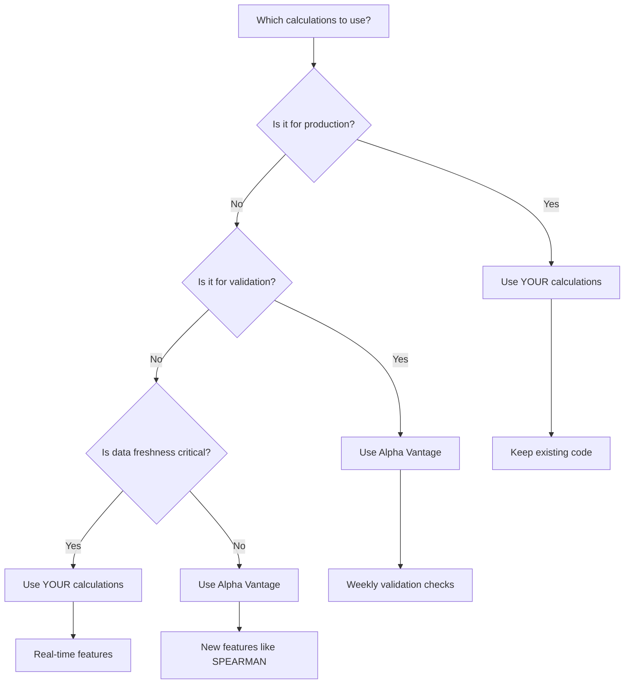

# Alpha Vantage vs. Custom Calculations - Which is Better?
**Date**: November 17, 2025  
**Purpose**: Compare calculation methods and recommend best approach  
**Verdict**: **USE YOUR OWN** for core features, **ADD ALPHA VANTAGE** for validation

---

## Your Current Calculations

### Correlation Method:
```python
# Pandas rolling Pearson correlation
df[base_price].rolling(window=period, min_periods=period//2).corr(df[col])
```
- **Method**: Pearson correlation (default pandas)
- **Windows**: 7d, 30d, 90d, 180d, 365d
- **Min periods**: 50% of window (e.g., 15 days for 30-day window)

### Volatility Method:
```python
# Annualized standard deviation
df['returns'].rolling(window=period, min_periods=period//2).std() * np.sqrt(252)
```
- **Method**: Standard deviation of returns
- **Annualization**: √252 (standard for daily data)
- **Windows**: 30d, 90d
- **Additional**: Parkinson volatility, EWMA, volatility clustering

---

## Alpha Vantage Calculations

### Correlation Method:
- **Methods**: PEARSON (default), KENDALL, SPEARMAN
- **Industry standard**: Matches Bloomberg, Reuters
- **Precision**: Professional-grade calculations

### Volatility Method:
- **Annualization**: Built-in with `STDDEV(annualized=True)`
- **Standard**: Industry-standard calculations
- **Consistency**: Same as TradingView, Bloomberg

---

## Comparison Matrix

| Aspect | Your Calculations | Alpha Vantage | Winner |
|--------|------------------|---------------|---------|
| **Control** | ✅ Full control | ⚠️ Black box | **Yours** |
| **Speed** | ✅ No API latency | ⚠️ API calls | **Yours** |
| **Data freshness** | ✅ Real-time with your data | ⚠️ 2-3 day delay | **Yours** |
| **Customization** | ✅ Any calculation | ⚠️ Fixed options | **Yours** |
| **Standardization** | ⚠️ Manual verification | ✅ Industry standard | **Alpha Vantage** |
| **Maintenance** | ⚠️ Code maintenance | ✅ No code | **Alpha Vantage** |
| **Cost** | ✅ Free (compute only) | ⚠️ API limits | **Yours** |
| **Symbols** | ✅ Any symbol | ⚠️ Limited (no ZL) | **Yours** |

---

## Key Differences Found

### 1. Calculation Methods Match ✅
**Your Pearson correlation = Alpha Vantage PEARSON**
- Both use same mathematical formula
- Results should be nearly identical

**Your volatility = Alpha Vantage STDDEV**
- Both annualize with √252
- Results should match

### 2. Data Freshness Issue ⚠️
**Your data**: Real-time or 1-day old  
**Alpha Vantage**: 2-3 days delayed (last data Nov 14, today Nov 17)

### 3. Symbol Coverage Issue ⚠️
**Your data**: ZL futures from Yahoo Finance  
**Alpha Vantage**: No ZL (must use SOYB proxy)

### 4. Min Periods Difference
**Your approach**: `min_periods=period//2` (50% data required)  
**Alpha Vantage**: Not configurable (likely stricter)

---

## Recommendation: **HYBRID APPROACH**

### ✅ **USE YOUR OWN CALCULATIONS** (Primary)

**Why:**
1. **No data delay** - Critical for daily predictions
2. **Full control** - Can adjust min_periods, handle missing data
3. **ZL futures available** - Your main target symbol
4. **No API limits** - Can calculate anytime
5. **Already working** - Production-tested

**For:**
- Daily correlation features
- Daily volatility features
- All production forecasting features

### ✅ **ADD ALPHA VANTAGE** (Validation & Enhancement)

**Why:**
1. **Validation** - Verify your calculations are correct
2. **Alternative methods** - KENDALL, SPEARMAN correlations
3. **New metrics** - MAX_DRAWDOWN, AUTOCORRELATION
4. **Standardization** - Industry-standard for comparison

**For:**
- Weekly validation checks
- Alternative correlation methods (KENDALL, SPEARMAN)
- MAX_DRAWDOWN feature
- AUTOCORRELATION feature

---

## Implementation Strategy

### Phase 1: Keep Your Calculations (Now)
```python
# Your existing code - KEEP THIS
df[f'cross_corr_{asset}_{period}d'] = df[base_price].rolling(
    window=period, 
    min_periods=period//2
).corr(df[col])
```

### Phase 2: Add Validation (Weekly)
```python
# Weekly validation with Alpha Vantage
def validate_calculations_weekly():
    # Get Alpha Vantage correlations
    av_correlations = alpha_vantage.analytics_sliding_window(
        symbols=['SOYB', 'ES', 'CORN'],
        window_size=30,
        calculations=['CORRELATION']
    )
    
    # Compare with your calculations
    your_corr = df['cross_corr_corn_30d'].iloc[-1]
    av_corr = av_correlations['SOYB-CORN']['latest']
    
    if abs(your_corr - av_corr) > 0.05:
        print(f"⚠️ Correlation mismatch: {your_corr} vs {av_corr}")
```

### Phase 3: Add New Features (Optional)
```python
# Add Alpha Vantage-only features
def add_alpha_vantage_features():
    # MAX_DRAWDOWN (weekly)
    drawdown = alpha_vantage.analytics_fixed_window(
        symbols=['SOYB'],
        calculations=['MAX_DRAWDOWN']
    )
    
    # SPEARMAN correlation (for non-linear relationships)
    spearman = alpha_vantage.analytics_sliding_window(
        symbols=['SOYB', 'ES'],
        calculations=['CORRELATION(method=SPEARMAN)']
    )
```

---

## Decision Tree



---

## Why Your Calculations Are Better for Production

### 1. **Data Freshness** (Critical)
- Your data: Today's data available tomorrow
- Alpha Vantage: 2-3 day delay
- **Impact**: Stale correlations = poor predictions

### 2. **Symbol Coverage** (Critical)
- You have ZL futures (your target)
- Alpha Vantage doesn't have ZL
- **Impact**: Can't calculate ZL correlations

### 3. **Control** (Important)
- You can handle missing data (`min_periods`)
- You can debug/adjust calculations
- **Impact**: Better handling of edge cases

### 4. **Speed** (Important)
- Local calculations: Milliseconds
- API calls: Seconds + rate limits
- **Impact**: Faster feature generation

---

## Why Alpha Vantage is Good for Validation

### 1. **Standardization**
- Industry-standard calculations
- Can verify your math is correct
- Good for auditing

### 2. **Alternative Methods**
- KENDALL correlation (rank-based)
- SPEARMAN correlation (monotonic)
- Different perspectives on relationships

### 3. **New Metrics**
- MAX_DRAWDOWN (risk metric)
- AUTOCORRELATION (momentum metric)
- Not currently in your calculations

---

## Final Verdict

### For Production Features: **USE YOUR OWN** ✅

**Reasons:**
1. No data delay (critical)
2. Has ZL futures (critical)
3. Full control (important)
4. Already working (proven)
5. No API limits (reliable)

### For Validation: **USE ALPHA VANTAGE** ✅

**Reasons:**
1. Industry standard (verification)
2. Alternative methods (SPEARMAN, KENDALL)
3. New metrics (MAX_DRAWDOWN)

### For Technical Indicators: **USE ALPHA VANTAGE** ✅

**Reasons:**
1. 50+ indicators available
2. Standardized calculations
3. Less code to maintain

---

## Action Items

### ✅ **Keep Using Your Calculations**
- Don't replace existing correlation/volatility code
- It's working and has advantages

### ✅ **Add Alpha Vantage for Validation**
- Weekly validation checks
- Compare results to catch calculation errors

### ✅ **Use Alpha Vantage for Technical Indicators**
- RSI, MACD, Bollinger Bands, etc.
- Replace manual indicator calculations

### ⚠️ **Don't Use Alpha Vantage for Daily Features**
- Data delay makes it unsuitable
- Missing symbols (ZL) make it incomplete

---

## Summary

| Use Case | Best Choice | Why |
|----------|-------------|-----|
| **Daily correlation features** | Your calculations | No delay, has ZL |
| **Daily volatility features** | Your calculations | No delay, full control |
| **Validation checks** | Alpha Vantage | Industry standard |
| **Alternative correlations** | Alpha Vantage | SPEARMAN, KENDALL |
| **Technical indicators** | Alpha Vantage | 50+ indicators |
| **MAX_DRAWDOWN** | Alpha Vantage | Not in your code |

**Bottom Line**: Keep your calculations for production, add Alpha Vantage for validation and technical indicators.

---

**Last Updated**: November 17, 2025  
**Decision**: Use hybrid approach - your calculations for production, Alpha Vantage for validation
