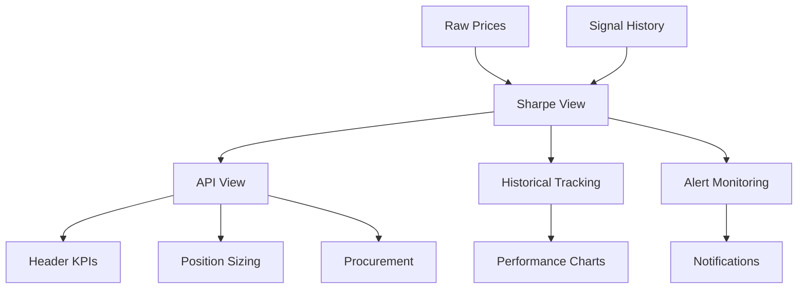

# Dashboard & Business Logic Integration Summary
**Date:** November 15, 2025  
**Purpose:** Document how Sharpe metrics flow through the system

---

## ✅ Added to Execution Plan: Phase 4B

### 1. Dashboard Consumption Modules

#### Header KPIs
- **Fields:** `soybean_adjusted_sharpe`, `win_rate_pct`, `soybean_profit_factor`, `max_drawdown_pct`
- **Display:** Badge with color coding based on performance rating
- **Source:** `api.vw_ultimate_adaptive_signal`

#### Performance Tab
- **Time-series:** Pull from `performance.soybean_sharpe_historical_tracking`
- **Seasonal bars:** Spring/Summer/Fall/Winter returns with best period highlight
- **USDA markers:** Overlay on timeline for context

#### MAPE + Sharpe Panel
- **Direction Quality:** Sharpe shows if we're right on direction
- **Magnitude Accuracy:** MAPE shows if we're right on size of move
- **Combined:** Both needed for complete picture to CFOs

---

## 2. Position Sizing Logic (`api.vw_position_sizing`)

### Base Sizing from Sharpe
```
Sharpe > 2.0  → 100% position
Sharpe > 1.5  → 75% position  
Sharpe > 1.0  → 50% position
Sharpe > 0.5  → 25% position
Sharpe ≤ 0.5  → 10% position (minimum)
```

### Multipliers Applied
- **Seasonal Advantage:** 1.25x when in best season
- **Regime Adjustment:** 0.8x in crisis, 1.2x in harvest
- **Weather Bonus:** 1.15x when weather-driven Sharpe > 1.5

### Output Categories
- **FULL:** 75-100% of capital
- **MODERATE:** 50-75% of capital
- **LIGHT:** 25-50% of capital
- **MINIMAL:** <25% of capital

---

## 3. Monitoring & Alerts (`monitoring.sharpe_alerts`)

### Alert Thresholds
| Metric | WARNING | CRITICAL |
|--------|---------|----------|
| Recent Sharpe | <0.8 | <0.5 |
| Sharpe Trend | <0.8 | <0.5 |
| Win Rate | <50% | <40% |
| Drawdown | >15% | >20% |

### Actions
- **CRITICAL:** Trading halt, immediate notification
- **WARNING:** Log for review, dashboard yellow flag
- **OK:** Normal operations

---

## 4. Procurement Opportunity Window (`api.vw_procurement_opportunity`)

### Confidence Bubble Sizing
Visual representation of opportunity confidence:
- **Large (100px):** Sharpe >1.8 AND MAPE <3%
- **Medium (75px):** Sharpe >1.2 AND MAPE <5%
- **Small (50px):** Sharpe >0.8 AND MAPE <8%
- **Minimal (25px):** All others

### Opportunity Score (0-100)
- Sharpe contributes up to 60 points
- Low MAPE contributes up to 40 points
- Combined for single procurement score

### Procurement Actions
- **EXECUTE_NOW:** High Sharpe + seasonal advantage + buy signal
- **PREPARE_ORDER:** Good Sharpe + buy signal
- **MONITOR:** Hold signal
- **AVOID:** Sell signal or poor metrics

---

## 5. Data Flow Architecture



---

## 6. UI Rendering Guidelines

### Color Coding
| Performance | Sharpe Range | Color | Hex |
|------------|--------------|-------|-----|
| EXCEPTIONAL | >2.5 | Deep Green | #0A6B0A |
| EXCELLENT | 1.8-2.5 | Green | #2E8B2E |
| GOOD | 1.2-1.8 | Light Green | #90EE90 |
| FAIR | 0.8-1.2 | Yellow | FFD700 |
| POOR | <0.8 | Red | #DC143C |

### Position Size Visualization
- **FULL:** 100% opacity, large icon
- **MODERATE:** 75% opacity, medium icon
- **LIGHT:** 50% opacity, small icon
- **MINIMAL:** 25% opacity, tiny icon

---

## 7. Implementation Sequence

1. **Core Sharpe View** - Must exist first (Phase 3)
2. **API Integration** - Expose metrics (Phase 4)
3. **Business Logic Views** - Position sizing, alerts, procurement (Phase 4B)
4. **Dashboard Queries** - Consume from API/tracking tables
5. **Alert System** - Monitor thresholds and trigger actions

---

## 8. Testing Verification

### Unit Tests
- [ ] Sharpe calculation matches expected values
- [ ] Position sizing scales correctly
- [ ] Alerts trigger at right thresholds
- [ ] Opportunity scores in valid range

### Integration Tests
- [ ] Dashboard loads all metrics
- [ ] Time-series charts render
- [ ] Position recommendations sensible
- [ ] Alerts flow to notification system

### Performance Tests
- [ ] Dashboard queries < 1 second
- [ ] Historical tracking appends idempotent
- [ ] No row explosion in CROSS JOINs

---

## Key Benefits

1. **Risk-Adjusted Sizing:** Positions scale with confidence
2. **Early Warning:** Alerts catch deteriorating performance
3. **Seasonal Advantage:** Exploit agricultural patterns
4. **Combined Metrics:** Direction (Sharpe) + Magnitude (MAPE) = Complete picture
5. **Actionable Output:** Clear BUY/HOLD/SELL with position sizes

---

## Dashboard Mock-up Reference

```
┌─────────────────────────────────────────────────────┐
│ HEADER KPIs                                         │
│ Sharpe: 1.85 🟢  Win: 67% ✓  PF: 2.3  DD: -12%    │
│ Rating: EXCELLENT  Season: SPRING (Active ✓)       │
└─────────────────────────────────────────────────────┘

┌──────────────────┬──────────────────────────────────┐
│ SHARPE TREND     │ SEASONAL PERFORMANCE             │
│ [Chart: 90 days] │ Spring: +15% ████████            │
│ ┌─1.85           │ Summer: +8%  ████                │
│ └─0.5            │ Fall:   +12% ██████              │
│                  │ Winter: -3%  ▒                   │
└──────────────────┴──────────────────────────────────┘

┌─────────────────────────────────────────────────────┐
│ POSITION RECOMMENDATION                             │
│ Size: MODERATE (65%)  [█████████░░░░░]             │
│ Base: 50% + Seasonal: +25% - Crisis: -10%          │
└─────────────────────────────────────────────────────┘

┌─────────────────────────────────────────────────────┐
│ PROCUREMENT OPPORTUNITY                             │
│ Score: 78/100  Action: PREPARE_ORDER                │
│ Confidence: [    ⬤    ]  (Large bubble)            │
└─────────────────────────────────────────────────────┘
```

---

**Status:** All dashboard integration points documented and added to execution plan
**Location:** Phase 4B in EXECUTION_PLAN_FINAL_20251115.md


